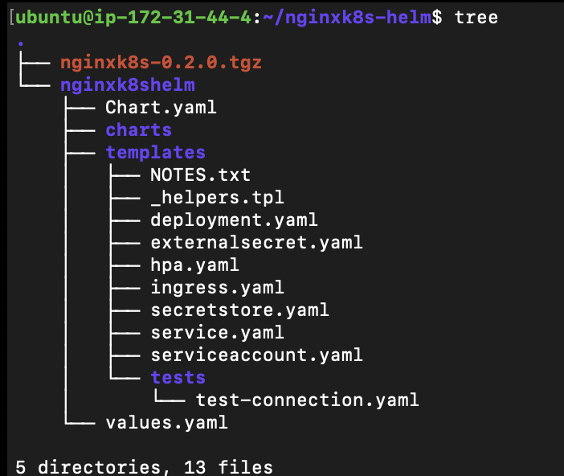
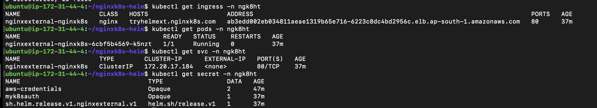
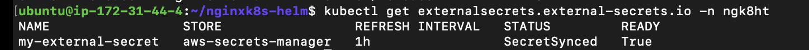
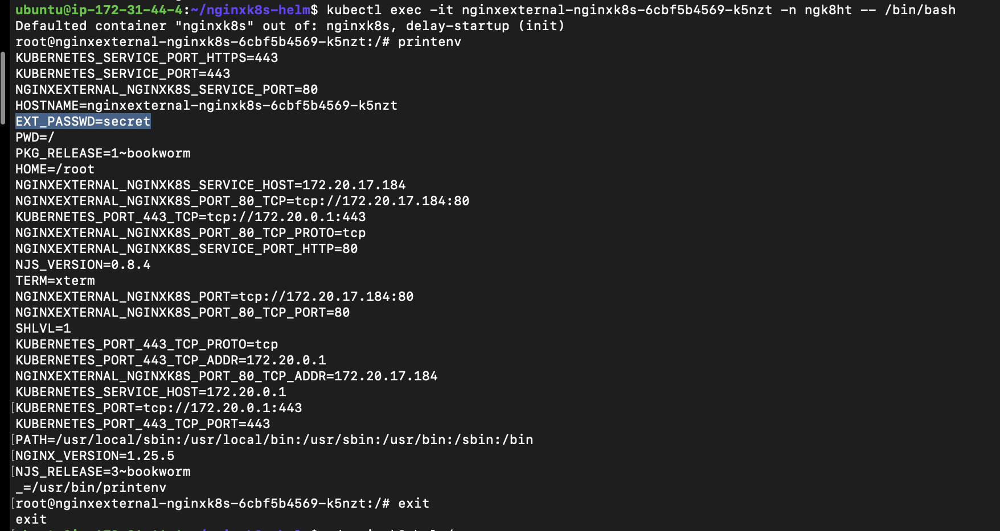

## Helm Chart for NGINX

This repository contains the helm chart for the deployment of nginx pod with autoscaling enabled and having external secrets configured.

Once this helm chart is deployed, this creates the following:

- 1 NGINX pod
- It's corresponding service
- Ingress which creates a load balancer on AWS
- Creates an external secret which is then used to create an env variable in the nginx pod

External secret which is syncing secret from AWS Secret Manager:

And we can see that the env variable is created inside the pod:

##### Best Practices used in this deployment

- Configured liveness and readiness probes to check healthy state
- Used autoscaling
- Used multiple nodes
- Modular code which is not hardcoded
- Used NGINX ingress controller which creates a load balancer in AWS
- Used External Secrets Operator to fetch passwords saved on AWS Secret Manager

##### Practices which can be configured in future

- Specifying scaleUp and scaleDown behaviour for HPA to counter flapping
- Specify resource requests and limits which checks for minimum resource requirements before scheduling and also limits resource usage to not affect other running processes
- Enable monitoring and logging
- Use affinity and node-selector to schedule pods on a particular node based on resource requirement
- Configure desired update strategy as required
- Configure RBAC for namespace or cluster
- Use admission controllers.
